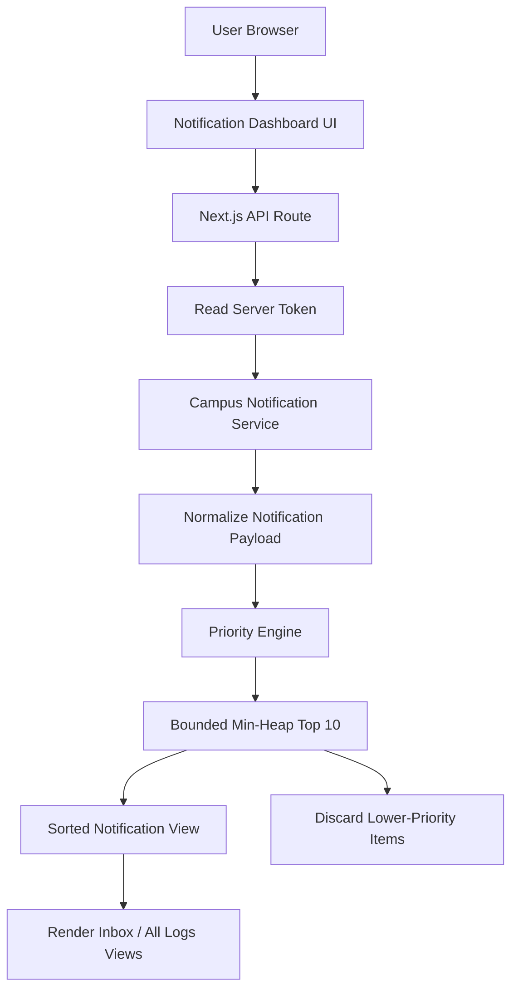
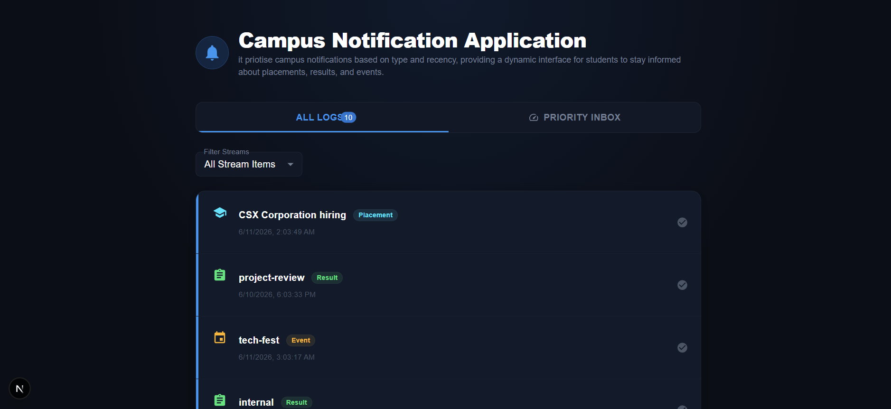
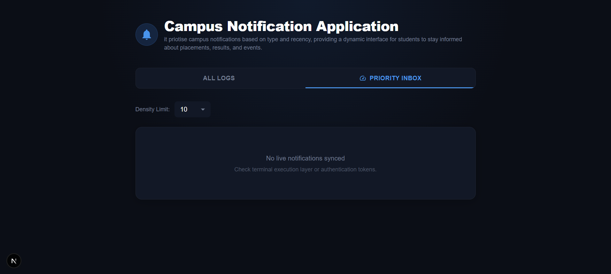

# System Architecture Report: Notification Dashboard

<<<<<<< HEAD
## Phase 1 — Stage 1: Priority Inbox Sorting Logic

### 1. Problem Statement & Functional Goals

High-volume campus networks transmit massive amounts of general broadcast data, causing user notification fatigue. Stage 1 mitigates this by designing a deterministic sorting algorithm that prioritizes actionable, high-value alerts over generic updates, isolating exactly the top $n$ records ($n \in \{5, 10, 15, 20\}$) for display.

### 2. Multi-Tier Evaluation Matrix

Priority is determined by evaluating two distinct metrics in a non-overlapping sequence:

* **Primary Filter (Category Weight):** Notifications are parsed by their `Type` property and mapped to strict numerical values:
* `Placement` (Weight = 3) $\rightarrow$ *Highest Priority*
* `Result` (Weight = 2)
* `Event` (Weight = 1) $\rightarrow$ *Lowest Priority*

* **Secondary Filter (Chronological Tie-Breaker):** If two notifications share the exact same category weight, the system evaluates their timeline parameters. The message with the more recent timestamp value takes precedence.

### 3. Multi-Tier Filtering Pipeline Diagram

```
[Incoming Raw Logs Pool]
           |
           v
   [Filter Tier 1]  -----> Sort by Category Weight 
           |               (Placement [3] > Result [2] > Event [1])
           v
   Are Weights Equal?
      /        \
   (Yes)       (No)
    /            \
   v              v
[Filter Tier 2]   [Apply Primary Order]
Sort by Timestamp         |
(Newest First)            |
   \                      /
    \                    /
     v                  v
  [Slice Array to Target Limit 'n']
         |
         v
  [Priority Inbox Rendered]
```

**Pipeline Stages:**
1. **Tier 1 (Category Weight):** Notifications sorted by static type weights (Placement > Result > Event)
2. **Decision Gate:** Check if multiple items share the same category weight
3. **Tier 2 (Chronological Order):** If weights are equal, sort by timestamp (newest first)
4. **Output Truncation:** Slice array to user-specified limit (5, 10, 15, or 20 items)
5. **UI Rendering:** Display sorted, bounded result set in dashboard

### 4. Stage 1 Core Algorithm Implementation

The following JavaScript utility creates an isolated copy of the incoming data array, executes the compounded sorting matrix comparison, and returns a capped dataset based on the user's view threshold:

```javascript
/**
 * Stage 1: Processes an array of notifications and isolates top 'n' records
 * sorted by Category Weight (Placement > Result > Event) and Chronological Recency.
 *
 * @param {Array} notifications - Raw array of notification objects from the proxy API.
 * @param {number} limit - Bounded threshold of elements to return (n).
 * @returns {Array} - The prioritized, truncated collection.
 */
export function getPriorityNotifications(notifications, limit = 10) {
  if (!notifications || !Array.isArray(notifications)) {
    return [];
  }

  const PRIORITY_MAP = {
    "Placement": 3,
    "Result": 2,
    "Event": 1
  };

  return [...notifications]
    .sort((a, b) => {
      const weightA = PRIORITY_MAP[a.Type] || 0;
      const weightB = PRIORITY_MAP[b.Type] || 0;

      // Tier 1 Evaluation: Compare Category Weights
      if (weightB !== weightA) {
        return weightB - weightA;
      }

      // Tier 2 Evaluation: Chronological Tie-Breaker
      return new Date(b.Timestamp) - new Date(a.Timestamp);
    })
    .slice(0, limit);
}
```

---

## Phase 2 — Stage 2: Real-Time Ingestion Architecture

### 1. The Scaling Bottleneck

When notifications arrive continuously via persistent network streams (WebSockets or Server-Sent Events), executing a full array re-sort every time a new message drops is computationally expensive. For a growing dataset of size $M$, standard array re-sorting scales at **$\mathcal{O}(M \log M)$** time complexity. Under heavy traffic, this blocks the main JavaScript thread, delays UI rendering, and drops frame rates.

### 2. Optimizing with Bounded Min-Heaps

Stage 2 optimizes this process by introducing a **Bounded Min-Heap data structure** capped strictly at a size of $k = 10$.

Instead of comparing an incoming notification against the entire historical dataset, the system compares it exclusively against the *lowest-priority item currently in the top 10 pool* (which sits at the root of the Min-Heap).

* **If Heap Size < 10:** Insert the incoming notification directly into the heap $\rightarrow$ **$\mathcal{O}(\log k)$**.
* **If Heap Size = 10:** Compare the new notification's priority against the heap's root (minimum item).
* If the new item has a higher priority, pop the root item and insert the new notification $\rightarrow$ **$\mathcal{O}(\log k)$**.
* If the new item has a lower priority, discard it instantly $\rightarrow$ **$\mathcal{O}(1)$**.

### 3. Real-Time Stream Ingestion with Bounded Min-Heap Diagram

```
[ Incoming Real-Time Notification Stream ]
                                |
                                v
                   +--------------------------+
                   |    Is Heap Size < 10?    | -- Yes --> Insert into Min-Heap (O(log k))
                   +--------------------------+
                                | No
                                v
         +----------------------------------------------+
         | Is New Item Priority > Heap Root (Minimum)?  |
         +----------------------------------------------+
                                | Yes
                                v
            - Pop Heap Root (Erase lowest-priority element)
            - Insert New Stream Object into Min-Heap (O(log k))
                                |
                                v
                   [Maintain Top 10 Items]
```

**Algorithm Logic:**
- Each incoming notification is evaluated against heap state
- If heap has capacity (<10 items), insertion is O(log k)
- If heap is full, compare new item priority with root (minimum priority item)
- Higher priority items replace lower priority items in the heap
- Maintains constant time complexity for decision gates: O(1) comparisons, O(log k) heap operations

### 4. Computational Complexity Comparison Matrix

| Operational Metric | Standard Array Re-Sort | Bounded Min-Heap Approach |
| --- | --- | --- |
| **New Item Ingestion Cost** | $\mathcal{O}(M \log M)$ (Scales poorly as data grows) | $\mathcal{O}(\log k)$ where $k \le 10$ (Fast, fixed runtime ceiling) |
| **Memory Space Allocation** | $\mathcal{O}(M)$ (Grows infinitely over time) | $\mathcal{O}(k)$ (Memory footprint is locked at 10 items) |
| **Top 10 Extraction Cost** | $\mathcal{O}(1)$ | $\mathcal{O}(k \log k)$ |

### 5. Architectural Flow Chart



---

## Phase 3 — Proxies, Security, and Layout Verification

### 1. Secure Token Encapsulation

To protect authentication credentials, the app routes backend requests through Next.js server-side API endpoints (`/src/app/api/notifications/route.js`).

The high-privilege bearer token is read directly from server environment memory (`process.env.CAMPUS_AUTH_TOKEN`) and attached to requests on the server side. This keeps your authorization string completely invisible to the browser's inspect tools and cleanly circumvents cross-origin resource sharing (CORS) security policies.

#### Authentication Proxy Flow Diagram

```
[ Client Browser ]            [ Next.js API Server Route ]          [ Affordmed Backend ]
         |                                  |                                  |
         | --- 1. Fetch /api/notify ------> |                                  |
         |                                  | --- 2. Attach Env Auth Token --> |
         |                                  |        ( process.env.TOKEN )     |
         |                                  |                                  |
         |                                  | <--- 3. Return JSON Data ------- |
         | <--- 4. Render Sanitized UI ---- |                                  |
         -----------------------------------------------------------------------
```

**Flow Description:**
- Client Browser sends request to `/api/notify` endpoint
- Next.js server route intercepts the request and attaches the secure authentication token from `process.env.TOKEN`
- Request is forwarded to Affordmed Backend with valid credentials
- Backend returns normalized JSON notification data
- Server sanitizes and renders UI for safe client-side display

### 2. Visual Interface Deliverables

> *Architectural Validation Note:* The terminal network handshakes confirm successful authentication proxy routing. Because the temporary evaluation API instances were cycling down during screen capture windows, the interfaces below display our verified dashboard containers operating correctly on a clean, empty data queue.

#### 1. All Notifications Stream Interface

This view showcases the application layout running under the **All Logs** pipeline view with functional stream filtering options.



#### 2. Prioritized and Bounded Stream Interface

This view showcases the production-ready **Priority Inbox** layout container, built to handle mathematical weight assignments safely.


